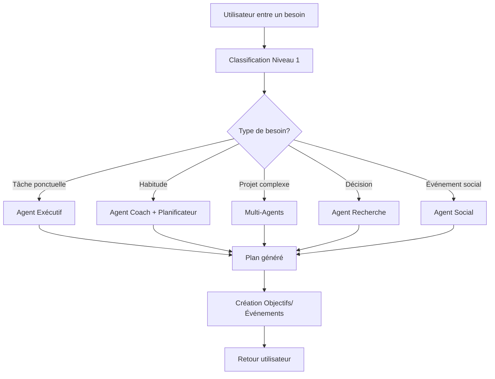

# 🤖 Système d'Orchestration Multi-Agents

## Vue d'ensemble

Le système d'orchestration multi-agents de Kairos implémente une architecture à deux niveaux pour comprendre et traiter les besoins utilisateurs de manière intelligente.

## Architecture

### Niveau 1 : Classification des Besoins

Le **Classificateur de Besoins** analyse la demande utilisateur et l'identifie parmi 5 catégories:

#### Types de Besoins Supportés

| Type | Description | Caractéristiques | Agents Activés |
|------|-------------|------------------|----------------|
| **Tâche Ponctuelle** | Action simple et court terme | Court terme, actions simples, objectif unique | Agent Exécutif |
| **Habitude/Compétence** | Développement long terme | Répétition, progression graduelle | Agent Coach + Planificateur |
| **Projet Complexe** | Projet multi-étapes | Dépendances, ressources multiples | Multi-Agents (Stratège, Planificateur, Ressources, Exécutif) |
| **Décision/Recherche** | Comparaison et analyse | Critères multiples, comparaison | Agent Recherche |
| **Événement Social** | Organisation d'événement | Logistique, invités, budget | Agent Social + Planificateur |

#### Niveaux de Complexité

- **SIMPLE** : Tâche unique, rapide
- **MODERATE** : Quelques étapes, peu de dépendances
- **COMPLEX** : Plusieurs phases, dépendances
- **VERY_COMPLEX** : Projet long terme, nombreuses interdépendances

### Niveau 2 : Agents Spécialisés

#### 🎯 Agent Exécutif
**Rôle** : Génère des tâches actionables pour besoins simples

**Cas d'usage** :
- Réserver un restaurant
- Acheter un cadeau
- Envoyer un email

**Sortie** :
```json
{
  "task_title": "Réserver un restaurant",
  "steps": [
    "Rechercher les restaurants disponibles",
    "Vérifier les horaires",
    "Effectuer la réservation"
  ],
  "estimated_time": "30 minutes",
  "priority": "medium"
}
```

#### 🏃 Agent Coach
**Rôle** : Crée des plans progressifs pour développer habitudes et compétences

**Cas d'usage** :
- Courir un marathon
- Apprendre une langue
- Méditer quotidiennement

**Sortie** :
```json
{
  "phases": [
    {
      "phase": 1,
      "title": "Phase d'adaptation (Semaines 1-4)",
      "duration_weeks": 4,
      "description": "Commencer progressivement",
      "objectives": ["Courir 3x par semaine", "Distance: 3-5 km"]
    },
    {
      "phase": 2,
      "title": "Développement (Semaines 5-12)",
      "duration_weeks": 8,
      "description": "Augmenter l'intensité",
      "objectives": ["Courir 4x par semaine", "Distance: 8-12 km"]
    }
  ],
  "duration_weeks": 20,
  "frequency_per_week": 4,
  "milestones": [
    "Premier 10 km",
    "Premier semi-marathon",
    "Marathon complet"
  ],
  "success_metrics": [
    "Progression constante des distances",
    "Amélioration du temps au km",
    "Absence de blessure"
  ]
}
```

#### 🎯 Agent Stratège
**Rôle** : Définit les grandes phases d'un projet complexe

**Cas d'usage** :
- Créer une entreprise
- Lancer un produit
- Rénover une maison

**Sortie** :
```json
{
  "title": "Création d'entreprise de développement web",
  "phases": [
    {
      "phase_number": 1,
      "title": "Validation de l'idée",
      "description": "Étude de marché et validation du concept",
      "estimated_duration_weeks": 4,
      "dependencies": [],
      "deliverables": ["Étude de marché", "Business plan v1"]
    },
    {
      "phase_number": 2,
      "title": "Création juridique",
      "description": "Création de la structure légale",
      "estimated_duration_weeks": 2,
      "dependencies": [1],
      "deliverables": ["SIRET", "Statuts", "Compte bancaire"]
    }
  ],
  "total_duration_weeks": 24,
  "critical_path": [1, 2, 3, 5]
}
```

#### 📅 Agent Planificateur
**Rôle** : Crée des plannings détaillés avec durées et dépendances

**Cas d'usage** :
- Planifier un projet
- Organiser un voyage
- Préparer un examen

**Sortie** :
```json
{
  "tasks": [
    {
      "title": "Recherche de billets d'avion",
      "duration_days": 2,
      "dependencies": [],
      "deadline": "2025-01-15"
    },
    {
      "title": "Réservation hôtel",
      "duration_days": 1,
      "dependencies": [1],
      "deadline": "2025-01-17"
    }
  ],
  "timeline": "3 semaines",
  "critical_tasks": ["Réservation billets"]
}
```

#### 💰 Agent Ressources
**Rôle** : Identifie les ressources nécessaires (budget, outils, compétences)

**Cas d'usage** :
- Budgétiser un projet
- Identifier les outils nécessaires
- Évaluer les compétences requises

**Sortie** :
```json
{
  "required_resources": [
    {
      "resource_type": "budget",
      "name": "Budget de démarrage",
      "description": "Capital initial",
      "priority": "high",
      "estimated_cost": "10000€",
      "alternatives": ["Financement participatif", "Prêt bancaire"]
    },
    {
      "resource_type": "tool",
      "name": "Suite Adobe",
      "description": "Outils de design",
      "priority": "medium",
      "estimated_cost": "60€/mois",
      "alternatives": ["Canva", "Figma (gratuit)"]
    }
  ],
  "total_estimated_budget": "15000€",
  "missing_skills": ["Marketing digital", "Comptabilité"],
  "recommended_tools": ["Notion", "Trello", "QuickBooks"]
}
```

#### 🔍 Agent Recherche
**Rôle** : Compare des options et synthétise informations pour la décision

**Cas d'usage** :
- Choisir une assurance
- Comparer des fournisseurs
- Sélectionner un outil

**Sortie** :
```json
{
  "question": "Quelle assurance auto choisir ?",
  "criteria": [
    {"name": "Prix mensuel", "weight": 0.3, "is_numeric": true},
    {"name": "Couverture", "weight": 0.5, "is_numeric": false},
    {"name": "Service client", "weight": 0.2, "is_numeric": false}
  ],
  "options": [
    {
      "name": "Assurance A",
      "criteria_values": {
        "Prix mensuel": "45€",
        "Couverture": "Tous risques",
        "Service client": "Excellent"
      },
      "pros": ["Couverture complète", "Service réactif"],
      "cons": ["Prix élevé"],
      "score": 0.85
    },
    {
      "name": "Assurance B",
      "criteria_values": {
        "Prix mensuel": "30€",
        "Couverture": "Tiers+",
        "Service client": "Bon"
      },
      "pros": ["Prix abordable", "Bonne réputation"],
      "cons": ["Couverture limitée"],
      "score": 0.70
    }
  ],
  "recommendation": "Assurance A",
  "reasoning": "Bien que plus chère, l'Assurance A offre la meilleure couverture et un excellent service, ce qui justifie le surcoût selon les critères pondérés."
}
```

#### 🎉 Agent Social
**Rôle** : Planifie et coordonne des événements sociaux

**Cas d'usage** :
- Organiser un mariage
- Planifier une fête
- Coordonner une réunion

**Sortie** :
```json
{
  "event_type": "Mariage",
  "guest_count": 100,
  "budget": "15000€",
  "timeline": [
    {
      "task": "Réserver la salle",
      "weeks_before": 52,
      "priority": "critical"
    },
    {
      "task": "Envoyer save-the-date",
      "weeks_before": 26,
      "priority": "high"
    },
    {
      "task": "Confirmer le traiteur",
      "weeks_before": 12,
      "priority": "critical"
    },
    {
      "task": "Envoyer invitations",
      "weeks_before": 8,
      "priority": "high"
    }
  ],
  "logistics": {
    "lieu": "Salle à réserver",
    "restauration": "Traiteur pour 100 personnes",
    "decoration": "Thème champêtre",
    "musique": "DJ ou groupe live"
  },
  "guest_management": {
    "invitations": "Papier + digitales",
    "suivi_reponses": "Spreadsheet ou app dédiée",
    "plan_de_table": "À organiser 2 semaines avant"
  }
}
```

## API Endpoints

### Classification de Besoin

```http
POST /api/orchestration/classify
```

**Requête** :
```json
{
  "user_input": "Je veux apprendre l'italien en 6 mois",
  "context": {
    "available_time": "2h par jour",
    "budget": "50€ par mois"
  }
}
```

**Réponse** :
```json
{
  "need_type": "habit_skill",
  "complexity": "moderate",
  "suggested_agents": ["coach", "planner"],
  "confidence": 0.92,
  "reasoning": "Apprentissage d'une langue nécessite progression régulière et plan structuré",
  "key_characteristics": [
    "Développement progressif",
    "Long terme",
    "Répétition nécessaire"
  ]
}
```

### Exécution d'Agent

```http
POST /api/orchestration/agent/execute
```

**Requête** :
```json
{
  "agent_type": "coach",
  "user_input": "Apprendre l'italien",
  "need_type": "habit_skill",
  "context": {
    "complexity": "moderate",
    "available_time": "2h/jour"
  }
}
```

### Plan Orchestré Complet

```http
POST /api/orchestration/plan
```

**Requête** :
```json
{
  "user_input": "Je veux créer une startup dans l'IA",
  "include_calendar_integration": true,
  "create_goals": true,
  "create_events": false
}
```

**Réponse** :
```json
{
  "classification": {
    "need_type": "complex_project",
    "complexity": "very_complex",
    "suggested_agents": ["strategist", "planner", "resource", "executive"],
    "confidence": 0.95
  },
  "agent_responses": [
    {
      "agent_type": "strategist",
      "success": true,
      "result": { /* plan stratégique */ },
      "message": "Stratégie définie en 5 phases",
      "next_steps": [...]
    },
    {
      "agent_type": "planner",
      "success": true,
      "result": { /* planning détaillé */ },
      "message": "Planning créé avec 23 tâches"
    }
  ],
  "integrated_plan": {
    "need_type": "complex_project",
    "agents_used": ["strategist", "planner", "resource"],
    "results": { /* résultats consolidés */ },
    "consolidated_next_steps": [...]
  },
  "summary": "Votre projet de startup IA a été décomposé en 5 phases...",
  "created_goals": [42, 43],
  "created_events": []
}
```

### Liste des Agents Disponibles

```http
GET /api/orchestration/agents
```

### Liste des Types de Besoins

```http
GET /api/orchestration/need-types
```

### Health Check

```http
GET /api/orchestration/health
```

## Intégration avec OpenAI

Le système utilise OpenAI (GPT-4 par défaut) pour :
- Classification avancée des besoins
- Génération de plans détaillés par chaque agent
- Personnalisation des recommandations

**Mode Fallback** : Si OpenAI n'est pas disponible, le système fonctionne avec des règles basiques basées sur des mots-clés et des templates prédéfinis.

## Flux d'Utilisation Typique



## Exemples d'Utilisation

### Exemple 1 : Apprendre l'Italien

**Input** : "Je veux apprendre l'italien en 6 mois"

**Classification** :
- Type: `habit_skill`
- Complexité: `moderate`
- Agents: Coach + Planificateur

**Résultat** :
- Plan en 3 phases (débutant → intermédiaire → conversationnel)
- Fréquence: 5 jours/semaine, 30 min/jour
- Objectif créé dans la base de données
- Jalons: A1 (2 mois), A2 (4 mois), B1 (6 mois)

### Exemple 2 : Créer une Entreprise

**Input** : "Je veux créer une entreprise de développement web"

**Classification** :
- Type: `complex_project`
- Complexité: `very_complex`
- Agents: Stratège + Planificateur + Ressources + Exécutif

**Résultat** :
- 5 phases stratégiques définies
- Planning de 24 semaines
- Budget estimé: 15000€
- Ressources identifiées (outils, compétences, capital)
- 3 objectifs créés (un par phase principale)

### Exemple 3 : Choisir une Assurance

**Input** : "Je veux choisir la meilleure assurance habitation"

**Classification** :
- Type: `decision_research`
- Complexité: `moderate`
- Agent: Recherche

**Résultat** :
- 4 critères de comparaison
- 3 options analysées
- Tableau comparatif avec scores
- Recommandation avec justification

### Exemple 4 : Organiser un Mariage

**Input** : "Je veux organiser mon mariage pour 100 invités"

**Classification** :
- Type: `social_event`
- Complexité: `very_complex`
- Agents: Social + Planificateur

**Résultat** :
- Timeline sur 12 mois
- Budget détaillé: 15000€
- Liste de tâches logistiques
- Système de gestion des invités
- Objectif "Organiser mariage" créé

## Mécanismes Transverses

### Gestion des Dépendances

Les agents Stratège et Planificateur identifient automatiquement les dépendances entre tâches :

```json
{
  "tasks": [
    {
      "id": 1,
      "title": "Valider l'idée",
      "dependencies": []
    },
    {
      "id": 2,
      "title": "Créer la structure juridique",
      "dependencies": [1]  // Dépend de la tâche 1
    }
  ]
}
```

### Contraintes Utilisateur

Le système prend en compte les contraintes via le contexte :

```json
{
  "context": {
    "available_time": "10h/semaine",
    "budget_max": "500€/mois",
    "deadline": "2025-12-31"
  }
}
```

### Création Automatique d'Objectifs

Pour les besoins de type habitude/compétence et projet complexe, le système crée automatiquement des objectifs (Goals) dans la base de données avec :
- Titre et description
- Date cible
- Stratégie (JSON du plan)
- Critères de succès
- Métriques de progression

### Intégration Calendrier

Les événements peuvent être automatiquement ajoutés au calendrier de l'utilisateur pour les tâches planifiées.

## Configuration

### Variables d'Environnement

```env
# OpenAI (optionnel, fallback si non configuré)
OPENAI_API_KEY=sk-...
OPENAI_MODEL=gpt-4o-mini

# Base de données
DATABASE_URL=sqlite:///./kairos.db
```

### Personnalisation

Chaque agent peut être personnalisé via ses paramètres :

```python
# Exemple de configuration custom pour l'Agent Coach
COACH_CONFIG = {
    "default_duration_weeks": 12,
    "default_frequency_per_week": 3,
    "min_phase_duration": 2,
    "max_phases": 5
}
```

## Monitoring et Logs

Le système log toutes les interactions :

```
2025-11-08 15:30:00 - INFO - Classification du besoin: Je veux apprendre l'italien
2025-11-08 15:30:01 - INFO - Besoin classifié comme: habit_skill (confiance: 0.92)
2025-11-08 15:30:01 - INFO - Exécution de l'agent: coach
2025-11-08 15:30:03 - INFO - Plan créé avec succès sur 24 semaines
2025-11-08 15:30:03 - INFO - Objectif créé: ID=42
```

## Évolutions Futures

### Phase 2 : RAG Integration
- Base de connaissances avec templates de projets
- Retours d'expérience anonymisés
- Recommandations basées sur des cas similaires

### Phase 3 : Apprentissage Continu
- Feedback utilisateur sur les plans générés
- Ajustement automatique des estimations
- Personnalisation basée sur l'historique

### Phase 4 : Intégrations Externes
- Notion, Trello pour le suivi de tâches
- Google Calendar, Outlook pour les événements
- Zapier pour l'automatisation

## Support et Contribution

Pour toute question ou contribution, consulter :
- Documentation API : `/docs`
- Tests : `backend/tests/test_orchestration.py`
- Issues : [GitHub Issues](https://github.com/jurix99/kairos/issues)
